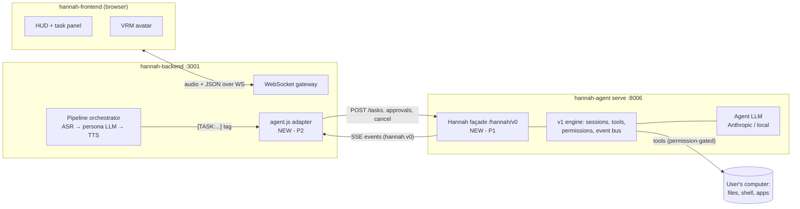

# Architecture — hannah-agent

> Status: **verified** — the Phase 0 engine audit (M0.1, executed 2026-08-18)
> confirmed or corrected every previously unverified claim. Full evidence with
> file:line references: [audit/M0.1-engine-audit.md](audit/M0.1-engine-audit.md).

## 1. The monorepo

Bun workspace, TypeScript throughout, Turborepo for task running, `tsgo`
(TypeScript native preview) for typechecking.

| Package | Name | Role |
| --- | --- | --- |
| `packages/agent` | `hannah-agent` | **Main package.** CLI entry, TUI launcher, HTTP server, session engine (v1), tools, MCP client, plugins, skills, auth, LSP. This is what `bun run dev` and the built binary execute. |
| `packages/core` | `@hannah/core` | **v2 rewrite in progress** (Effect-based). Sessions, tools, config, storage, permission, provider catalog re-implemented on `effect`. Partially consumed by `packages/agent` already. |
| `packages/server` | `@hannah/server` | v2 HTTP layer: routes/handlers/middleware on Effect HttpApi. |
| `packages/protocol` | `@hannah/protocol` | v2 API contract: endpoint groups, errors, middleware types. |
| `packages/schema` | `@hannah/schema` | Shared zod/Effect schemas: sessions, messages, events, permissions, config. The event manifest lives here. |
| `packages/llm` | `@hannah/llm` | Provider abstraction over Vercel `ai` SDK (Anthropic, OpenAI, Google, Groq, Ollama-compatible, many more) + models.dev catalog data. |
| `packages/plugin` | `@hannah/plugin` | Plugin API surface (hooks into events, tools, config). |
| `packages/sdk` (`sdk/js`) | `@hannah/sdk` | Generated JS client for the server API (+ `openapi.json`). |
| `packages/tui` | `@hannah/tui` | Terminal UI (Solid + opentui). Dev harness for us — see ADR-0011. |
| `packages/ui` | `@hannah/ui` | Shared UI primitives used by the TUI. |
| `packages/codemode` | `@hannah/codemode` | "Code mode" — lets the model write scripts that call tools programmatically. |
| `packages/http-recorder` | `@hannah/http-recorder` | HTTP record/replay for tests. |
| `packages/effect-drizzle-sqlite`, `packages/effect-sqlite-node` | — | SQLite/drizzle glue for the Effect stack. |
| `packages/script` | `@hannah/script` | Internal build/release script helpers. |

Support dirs: `patches/` (vendored third-party patches — do not touch;
`__OPENCODE_PHOTON_WASM_PATH` in source must keep matching the photon patch),
`specs/` (upstream design notes, including the v2 migration docs — historical
reference).

## 2. The v1 ↔ v2 duality (most important structural fact)

The snapshot is **mid-refactor**. Two generations coexist:

- **v1** = `packages/agent/src/*` — the code that actually ships and runs:
  CLI commands, server, session runner, tool implementations.
- **v2** = `core`/`server`/`protocol`/`schema` — an Effect-based rewrite that v1
  progressively imports (e.g. `serve.ts` already pulls `@hannah/core/flag`).
  `specs/v2/*.md` shows the migration was still being designed at snapshot time
  (fields marked `pending`).

Audit correction to this picture: the split runs through the *runtime services*,
not the HTTP layer — even the "v1" server is built on Effect HttpApi, and it
exposes **two wire surfaces at once** (legacy `/session`-style routes and v2
`/api/*` routes) backed by the same in-process services. The shipping TUI
drives `/api/*` (`@hannah/sdk/v2`). The façade binds to the shared services
in-process, so this duality never leaks into Hannah.

**Consequences for us** (ADR-0004): we do not continue upstream's migration and we
do not fight it. We build Hannah's façade against the *running* v1 entry points,
keep the v2 packages as-is (they typecheck and parts are load-bearing), and treat
any internal engine refactor as out of scope until the façade is stable.

## 3. Engine anatomy (v1, `packages/agent/src/`)

### CLI commands (`cli/cmd/`)
`run` (one-shot prompt), `serve` (headless HTTP server — **Hannah's mode**),
`tui` (interactive terminal client), `attach`, `acp` (Agent Client Protocol,
stdio JSON-RPC for editors), `web`, `mcp`, `agent`, `session`, `models`,
`providers`, `github`/`pr`, `import`/`export`, `db`, `stats`, `debug`,
`plug`, `upgrade`, `uninstall`, `generate`.

Relevant for Hannah: `serve` (runtime), `run` (smoke tests), `tui` (debugging),
`generate` (SDK/openapi regeneration). The rest is inventory to prune or ignore
(see ROADMAP P1).

### Tool catalog (`tool/`)
`shell` (bash execution), `read`, `edit`, `apply_patch`, `glob`, `grep`,
`question` (**ask the user — the natural hook for voice approvals/questions**),
`plan` (plan mode enter/exit), `task` (spawn subagent), `todo`/`todowrite`,
`skill` (load skill instructions), `lsp`, `code-mode`, `mcp-websearch`,
`external-directory`. Each tool has a `.txt` prompt beside it.

### Permission system (`permission/`, `@hannah/schema/permission*`)
Config-driven allow/ask/deny gates evaluated per tool invocation; `ask` surfaces
a permission request to the client, which must respond (TUI dialog today; Hannah
voice/HUD tomorrow). Verified (audit §4): config `permission` key with per-tool
rules and per-pattern maps; shell asks as `bash` with **per-command-prefix
patterns** (arity table), so SECURITY's preset matrices are directly
expressible; respond via `POST /permission/{requestID}/reply`
(`once`/`always`/`reject` + optional feedback); unmatched default is `ask`;
`always` approvals are in-memory only; **the engine has no ask timeout** —
timeout⇒deny is façade-implemented (M1.3).

### Server (`server/`)
HTTP server started by `serve`; Effect HttpApi groups+handlers under
`server/routes/instance/httpapi/`, SSE event streams, mDNS advertisement
(`server/mdns.ts` — off by default, loopback-skipped). Verified (audit §1):
**188 routes**, reference spec `packages/sdk/openapi.json` (regenerated,
matches source); binds `127.0.0.1`, port preference 4096; per-request project
instance selected by the `x-hannah-agent-directory` header; auth
is optional **HTTP Basic** via `HANNAH_AGENT_SERVER_PASSWORD` (unset =
unsecured localhost trust). SSE is **live-only** — no `Last-Event-ID` replay
anywhere; the façade owns seq + resume buffering (audit §3).

### Sessions & events (`session/`, `bus/`, `event-manifest.ts`)
Two persistence layers, both under the global data dir (audit §7): the v1 JSON
store (`<data>/storage/session/{info,message,part}/…` — where session content
lives) and SQLite (`<data>/hannah-agent.db`, or `hannah-agent-local.db` when
running from source; override `HANNAH_AGENT_DB`) for the v2-stack tables. All state
changes publish typed events on the internal bus (`EventV2Bridge`), manifest in
`@hannah/schema/event-manifest`: **89 event types** (audit §2). The
`session.next.*` family (33 streaming events: text deltas, tool calls, steps,
reasoning) plus `permission.asked`/`question.asked`/`todo.updated`/
`session.idle`/`session.error` cover the whole `hannah.v0` vocabulary — the
façade subscribes to this bus and translates.

### Providers (`provider/`, `@hannah/llm`)
Multi-provider via `ai` SDK; model metadata fetched from
`https://models.dev` (cached; kill switch `HANNAH_AGENT_DISABLE_MODELS_FETCH`,
override `HANNAH_AGENT_MODELS_URL`/`_PATH`. Upstream pointed this at its own
byte-identical mirror; M1.1 repointed it at the origin); auth flows per provider (`auth/`, `account/`). Model selection
comes from config + per-agent overrides. Boot matrix: all four shapes pass with
the M1.1 profiles — offline, Anthropic, Ollama, and air-gapped (inside a
network namespace). Re-run with `scripts/boot-matrix.sh`.

### Extension surfaces
- **Plugins** (`plugin/`): JS modules hooked into engine events/config.
- **Skills** (`skill/`): markdown instruction packs loadable by the `skill` tool.
  **Likely the mechanism for Hannah's macro library** (P3) — curated skills like
  `organize-downloads`, `open-project`.
- **MCP** (`mcp/`): client for Model Context Protocol servers — the controlled
  door to browser automation and other desktop capabilities later (ADR pending
  in P3).
- **ACP** (`acp/`): standardized agent protocol over stdio. Not chosen as the
  Hannah transport (ADR-0005) but kept as a working reference.

### Phone-home surfaces (verified — audit §8 has the full egress inventory)
Default `serve` egress is exactly two classes: the model catalog
(`models.dev`) and the configured provider API. Everything else is
opt-in and traced: share (`opncd.ai`, explicit call only; hard-off via
`HANNAH_AGENT_DISABLE_SHARE`), upstream console/account
(`console.opencode.ai`, only via `account` cmd or provider id `opencode`),
upgrade checks (**TUI worker only — `serve` never checks**; brew/scoop/GitHub/
npm), websearch tools (`mcp.exa.ai`/`search.parallel.ai` — send query text;
permission-gated per preset), npm registry (plugin installs), OTLP telemetry
(only if `OTEL_EXPORTER_OTLP_ENDPOINT` set), mDNS (flag, loopback-skipped).

## 4. Target architecture (Hannah system view)

Design rules encoded here:

1. **One seam.** Backend ⇄ agent traffic goes exclusively through the façade
   (`/hannah/v0`, plain HTTP + SSE — ADR-0005/0006). The backend never imports
   engine code and never calls native engine routes.
2. **The engine doesn't speak.** Narration, emotion, Spanish, TTS — all backend.
   The façade emits structured, narratable events (INTEGRATION.md defines them).
3. **The persona doesn't execute.** No tool calls in the backend LLM, ever.
4. **Sidecar discipline** (inherited from backend rules): agent disabled by
   default in backend config; every backend code path works with the sidecar
   down; `AGENT_SIDECAR_URL` flips it on, mirroring `MOTION_SIDECAR_URL`.

## 5. Where new code will live

| Concern | Location | Phase |
| --- | --- | --- |
| Hannah façade routes + event translator | `packages/agent/src/hannah/` (new module, mounted by `server/`) | P1 |
| Hannah config profile (providers, permissions, disabled services) | `packages/agent/src/hannah/profile.ts` + documented `hannah-agent.jsonc` | P1 |
| Macro skills | `skills/` (new top-level dir, engine skill format) | P3 |
| Backend adapter | `hannah-backend/src/pipeline/agent.js` (other repo; spec lives here in INTEGRATION.md) | P2 |
| Frontend task panel | `hannah-frontend/src/components/` (other repo) | P2/P3 |

Keeping façade code in one new directory keeps the fork diff against the frozen
upstream snapshot legible (UPSTREAM.md).

## 6. Audit checklist (M0.1 — executed 2026-08-18)

All items done; evidence in [audit/M0.1-engine-audit.md](audit/M0.1-engine-audit.md):

- [x] Route table (188 routes; reference `packages/sdk/openapi.json`, verified
      against regenerated spec) — audit §1
- [x] Event catalog (89 types; façade-relevant subset marked) — audit §2
- [x] Permission config schema, response endpoint, timeout behavior (none in
      engine ⇒ façade-owned) — audit §4
- [x] `question` round-trip — audit §5
- [x] Abort semantics — audit §6
- [x] Storage locations & persistence split (JSON store + SQLite) — audit §7
- [x] Network egress inventory (traced to call sites) — audit §8
- [x] Minimal-config boot matrix (offline row executed; provider rows
      code-verified, live in M1.1) — audit §9
- [x] Subagent limits (depth 1 default, permission-gated spawn) — audit §10
- [x] Test-suite shape → quarantine list — audit §11 +
      [audit/M0.4-test-baseline.md](audit/M0.4-test-baseline.md)
