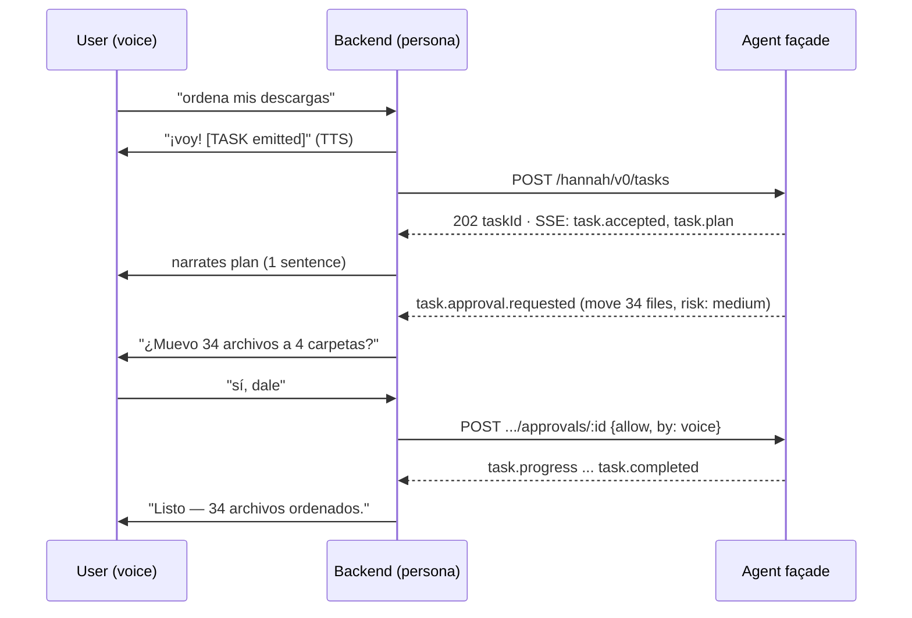
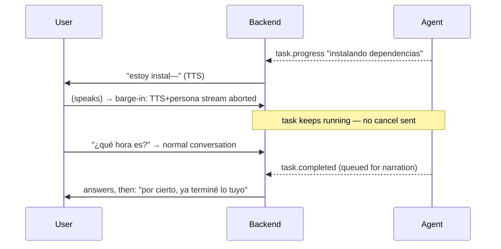

# Integration Contract — hannah-backend ⇄ hannah-agent

> Status: **v0 implemented on the agent side** (M1.3, 2026-08-19). The routes,
> the event vocabulary, SSE resume, approval timeouts, the 409 guard, bearer
> auth and the audit log are live in `packages/agent/src/hannah/facade/`; the
> backend side is P2. Any change from here requires an ADR.
> Transport decision: ADR-0005. Façade design: ADR-0006.
>
> Canonical event streams for backend tests: [`docs/fixtures/`](fixtures/) —
> generated from the real façade, not hand-written
> (`HANNAH_WRITE_FIXTURES=1 bun test test/hannah/fixtures.test.ts`).
> The sensitive-path denylist is pinned beside them as
> [`policy-paths.json`](fixtures/policy-paths.json), generated from
> `policy/paths.ts` (`bun run scripts/emit-policy-asset.ts`) so a consumer in
> another language classifies paths against this table instead of a second copy.
>
> **§4.5 is a second contract in this file and not the façade's**: `sense.v1`,
> the watch wire types between the backend and the HUD (P5.1, 2026-08-27). It
> lives here because §4 is where backend↔frontend message types have been
> tabulated since P2, and because a HUD written without it re-invents the
> delivery rule, which is the rule that keeps a trip from being read to the wrong
> person.

## 1. Topology & lifecycle

- hannah-agent runs as a **local sidecar**: `hannah-agent serve`, bound to
  `127.0.0.1:8006` (next free slot in the backend's sidecar port scheme).
- The backend reaches it via `AGENT_SIDECAR_URL` (default `http://127.0.0.1:8006`),
  feature-flagged by `AGENT_ENABLED=false` by default — identical pattern to
  `MOTION_SIDECAR_URL`/`config.motion.enabled`.
- Process management is external (dev: a terminal / `npm run sidecar:agent`
  script in the backend; later: systemd user unit — ROADMAP M4.5). The backend
  never spawns it.
- **Auth**: the façade requires a bearer token when `HANNAH_AGENT_TOKEN` is set;
  the backend passes the same value. The `hannah` launcher generates it into the
  backend's `.env` when empty and exports the same secret as
  `HANNAH_AGENT_SERVER_PASSWORD`, so the engine's native API (`/session`, `/config`…)
  is behind basic auth too. Localhost-only binding is the first line of defense,
  the token the second (SECURITY.md §4). The façade also refuses requests carrying
  an `Origin` header (a browser is never a legitimate client) and non-JSON bodies.
- **Mode ceiling**: a task may request a narrower preset than the operator's
  `AGENT_MODE`, never a wider one (`HANNAH_AGENT_MAX_MODE`, default `companion`).
- **Tool shells** never inherit `*_API_KEY`/`*_TOKEN`/`*_SECRET` variables nor
  `HANNAH_AGENT_*`; `env`/`printenv` are no longer in the always-allowed list.
- **Health**: backend polls `GET /hannah/v0/health` on boot and surfaces agent
  availability to the frontend (`agent_available` flag in its session state).

## 2. Façade HTTP API (`/hannah/v0`)

Versioned prefix; breaking changes bump `v0` → `v1`. All bodies JSON.

| Method & path | Purpose |
| --- | --- |
| `GET /hannah/v0/history?limit=` | `{ tasks: [HistoryRow] }` — live tasks plus what the audit log remembers, newest first |
| `GET /hannah/v0/tasks/{id}/trail?limit=` | `{ taskId, entries }` — the recorded trail for one task |
| `GET /hannah/v0/health` | `{ healthy, version, engineVersion, activeTasks, workspaces: [{id,path}], trash }` |
| `POST /hannah/v0/tasks` | Create a task. → `202 { taskId }` |
| `GET /hannah/v0/tasks` | List recent tasks (id, title, state, timestamps). |
| `GET /hannah/v0/tasks/:id` | Full status incl. last progress summary + stats. |
| `GET /hannah/v0/events` | **SSE stream** of all task events (global, single connection; `Last-Event-ID` resume). |
| `POST /hannah/v0/tasks/:id/approvals/:approvalId` | `{ decision: "allow" \| "deny", by: "voice" \| "hud" \| "timeout" }` |
| `POST /hannah/v0/tasks/:id/answer` | `{ questionId, answer }` — reply to a `task.question`. |
| `POST /hannah/v0/tasks/:id/cancel` | `{ reason?: "user" \| "shutdown" }` Graceful stop. |

### Create-task request

```jsonc
{
  "prompt": "Organize ~/Downloads into folders by file type",  // required — imperative, English
  "title": "ordenar descargas",       // short label for HUD/history (persona's words)
  "cwd": "/home/user/Downloads",      // optional; must fall inside an allowed workspace root
  "mode": "companion",                // permission preset: companion | trusted-project | paranoid (ADR-0010)
  "timeboxMs": 600000,                // hard cap; task.failed with reason "timebox" when exceeded
  "context": {                        // optional, persona-provided color
    "conversationSummary": "user is cleaning up before a stream",
    "language": "es"                  // language for user-facing strings in events
  }
}
```

Concurrency (M3.4): **one lane plus a bounded queue.** A second `POST` while one
is running is accepted with `202 { taskId, queued: true, position }` and starts
when the lane frees; `409 { activeTaskId }` now means *the queue is full*
(`MAX_QUEUED`, 3), which is a real refusal rather than "not right now".

One lane rather than N is deliberate: concurrency would multiply the two things
that are genuinely hard here — approvals arriving from two places at once, and a
narrator with two stories to tell. A queue lifts the 409 without buying either.

`task.accepted` carries `queued: true` and `position` for a waiting task, and
nothing for one that started. `task.started` is the signal that a queued task
actually began — and the backend narrates it, because for a queued task
*starting* is news. `GET /tasks/{id}` carries the live `queuePosition`, since
the queue shifts underneath.

`narration: "full" | "final"` on create is "avísame solo cuando termines". It
rides on the task and echoes in `task.accepted`; the backend applies it. The HUD
always shows everything. Approvals and questions are **never** silenced by it —
an unheard approval times out into a deny and the task dies without the user
knowing why.

Superseded: the pre-M3.4 rule was one foreground task and a 409 for the second.

### Task states

`accepted → running → (awaiting_approval | awaiting_answer)* → completed | failed | cancelled`

## 3. Event vocabulary (`hannah.v0`)

SSE envelope — one JSON object per event:

```jsonc
{ "v": "hannah.v0", "taskId": "t_01J...", "seq": 17, "ts": 1765700000000,
  "type": "task.progress", "data": { ... } }
```

`seq` is per-task and monotonic; the backend uses it for dedupe/resume.

> Implementation notes (fixed by the M0.1 audit, 2026-08-18): the engine's own
> SSE stream is live-only — no `Last-Event-ID` support exists there — so the
> façade assigns `seq` and keeps a per-task ring buffer to serve resume itself.
> Likewise the engine has **no timeout on permission/question asks**; the
> `timeoutMs` → deny rule below is enforced by the façade, which replies
> `reject` to the engine when the clock runs out.

| `type` | `data` | Narrate? |
| --- | --- | --- |
| `task.accepted` | `{ title, mode, cwd }` | yes — "voy con eso" |
| `task.started` | `{ model }` | no |
| `task.plan` | `{ summary, steps[] }` (when the engine plans first) | yes — one sentence |
| `task.progress` | `{ summary, detail?, answer? }` — human sentence, **≤120 chars**, throttled ≥5 s per task | selectively (see §6) |
| `task.tool` | `{ tool, status: "started"\|"done"\|"failed", target?, command?, preview?, summary }` — `command` is the full shell command on `started`, `preview` the first lines of its output on `done` (both redacted); the terminal panel echoes them | no (HUD only) |
| `task.approval.requested` | `{ approvalId, kind: "shell"\|"edit"\|"delete"\|"network"\|"other", summary, command?, paths?, risk: "low"\|"medium"\|"high", timeoutMs }` | **always** |
| `task.approval.resolved` | `{ approvalId, decision, by }` | only if denied by timeout |
| `task.question` | `{ questionId, text, options? }` | **always** |
| `task.answered` | `{ questionId }` | no |
| `task.output` | `{ text, summary }` — the agent's prose in full (≤4000 chars) | never on its own (see below) |
| `task.completed` | `{ summary, answer?, stats: { durationMs, toolCalls, filesTouched, tokensIn, tokensOut, costUsd? } }` | **always** |
| `task.failed` | `{ summary, error, recoverable }` | **always** |
| `task.cancelled` | `{ reason }` | yes, briefly |

Rules for event authors (façade translator, P1):

- `summary` fields are **plain, speakable sentences in the task's `language`** —
  no paths unless essential, no jargon, no markdown.
- The façade *translates* engine-bus events into this vocabulary; it never leaks
  raw engine event names across the seam.
- Everything is HUD-renderable; only the "Narrate? = yes" rows are candidates
  for speech.

### Implementation notes (M1.3)

Four behaviors are the façade's alone, because the engine does not provide them
(M0.1 audit §3, §4):

- **`seq` and resume.** The store assigns a per-task `seq` (what the backend
  dedupes on) *and* a global cursor used as the SSE `id:`. Two counters, because
  resume needs one ordering across all tasks while the backend reasons per task.
  On reconnect the façade replays from its ring buffer and, when the buffer had
  already dropped part of the gap, says so in a `: hannah.resume … truncated=true`
  comment rather than pretending the replay was complete.
- **Approval and question timeouts.** The engine blocks forever on an
  unanswered ask. The façade times out (`timeoutMs`, default 120 s), replies
  `reject` to the engine, and emits `task.approval.resolved` with `by: "timeout"`.
  Silence means no.
- **The timebox.** A task that exceeds `timeboxMs` is failed with
  `error: "timebox"` and the engine run is interrupted.
- **Ordering on cancel.** State flips to `cancelled`/`failed` *before* the
  engine interrupt is awaited. Interrupting makes the in-flight prompt settle,
  and if that settles first the run loop would report `task.completed` for a
  task the user just cancelled — the one bug in this area that would be actively
  dishonest to the user.

`high`-risk approvals are refused with `409` when granted `by: "voice"`
(SECURITY T7): the HUD button is the second factor. Denying by voice is always
accepted — only *granting* needs confirmation.

### 2.1 History (M3.5)

History is **derived from the audit log**, not stored separately. The log already
records every task's whole life, is append-only, and already has a retention
policy; a second store would be a second source of truth, and the disagreement
would surface as Hannah describing a task the log says never happened.

A row carries what the task was, how it ended, and — the interesting part — how
many approvals it asked for and how many were granted. Live tasks win over
recorded ones on overlap: same task, further along.

Retention is enforced **at startup**, not by a command, because a policy nobody
remembers to run is not a policy. Rotation is by day, so trimming deletes whole
files: a log you have to rewrite to trim is a log you can corrupt while
trimming. `scripts/audit-purge.ts` exists for trimming harder than the
configured window without a restart, and for seeing what would go first.

### 3.0 Where a task runs (M3.1)

`task.accepted` carries `workspace` alongside `cwd` — the id of the root the
directory belongs to, if any, so the HUD can show "downloads" instead of a path
and the audit log records *why* that directory was chosen.

The agent resolves the directory itself: an explicit `cwd`, then a real path in
the prompt, then a root named in the prompt (accent- and case-insensitive, both
languages), then the fallback. The backend may still send `cwd` and it wins, but
it no longer has to guess.

`health.workspaces` is the list the backend puts in the persona's system prompt.
It contains only directories that exist on this machine, because a persona that
offers to tidy a folder nobody can open is worse than one that offers nothing.
`health.trash` names the reversible-delete tool, or `null`.

**Roots are ergonomics, not a boundary** — D3 made the workspace root `/`
(SECURITY §4, §5).

### 3.1 The answer path (M3.0)

Most tasks are a side effect — "I moved 23 files" — and a 120-character summary
says everything there is to say. Some tasks *are* their output: a status report,
a search, "find the file that…". For those, the summary is not a description of
the result, it is a truncation of it.

So assistant prose longer than 120 characters (or containing a line break) is
emitted **twice**: once shortened as `task.progress`, carrying `answer: true`,
and once whole as `task.output`. The last such text also rides on
`task.completed` as `answer`, and appears in `GET /tasks/{id}` so it survives a
reconcile.

`answer: true` on a progress line means **do not speak this one** — the full
text is one event behind. Saying half an answer aloud and then saying the answer
is worse than either alone, and only the façade knows what is coming next.

Delivery splits the way the rest of this seam already splits: **the HUD gets the
full text, the voice gets the gist.** The backend hands the persona up to 1200
characters of the answer with an instruction to deliver it in at most two
sentences and mention that the detail is on screen. Reading a twenty-line list
out loud is worse than not answering.

Related: `context.language` is now read rather than merely stored — a non-English
task appends an instruction that the agent address the user in that language,
while leaving commands, code, paths and tool arguments untouched. Before this,
the agent always answered in English and the persona had to translate on the
fly, which loses detail and sounds like it.

## 4. Backend responsibilities (P2 — spec for `hannah-backend`)

### 4.1 Dispatch — the `[TASK:]` protocol

Extend the fixed tag protocol in `backend/src/config.js` (alongside `[MOTION:]` /
`[EMOTION:]`):

- The persona LLM may emit at most one `[TASK: imperative description]` per
  response, only when the user asked for something actionable on the computer.
- The orchestrator (`processAndSendSegment`) strips the tag from
  subtitle/TTS/motion exactly like `[MOTION:]`, and hands the description to
  `agent.js` → `POST /hannah/v0/tasks` (persona also supplies `title` and
  `context.language`).
- If `AGENT_ENABLED=false` or health-check failed, the protocol instructs the
  persona to say it can't do that right now — the tag path must degrade to
  conversation, not error.

### 4.2 New WebSocket message types (backend → frontend)

> Implemented in `backend/src/gateway/agentBridge.js` (M2.3, 2026-08-21).

| WS `type` | Source event | Frontend behavior |
| --- | --- | --- |
| `agent_task_started` | `task.accepted` | HUD task panel appears |
| `agent_task_progress` | `task.started` / `plan` / `progress` / `tool` / `output` / `approval.resolved` / `answered` | update panel timeline |
| `agent_approval_request` | `task.approval.requested` | modal buttons in HUD **and** avatar asks aloud |
| `agent_question` | `task.question` | same pattern as approvals |
| `agent_task_done` | `task.completed` / `failed` / `cancelled` | final state + stats in panel |

Every `agent_task_progress` carries a `kind` naming which event produced it, so
the panel can render a plan differently from a shell command without the
frontend learning engine vocabulary. `task.approval.resolved` and
`task.answered` are folded in here rather than getting types of their own: for
the HUD they *are* timeline entries, and the pending modal closes on them —
including when the resolver was voice or the 120 s timeout rather than a click.

`agent_approval_request` and `agent_question` add an `expiresAt` (absolute ms,
derived from `timeoutMs` on arrival) so the HUD can show the countdown. Silence
means "no", and a button with no clock on it hides that.

Frontend → backend: `AGENT_APPROVAL { taskId, approvalId, decision }`,
`AGENT_ANSWER { taskId, questionId, answer }`, `AGENT_CANCEL { taskId }` (HUD
buttons), which the backend forwards to the façade with `by: "hud"` — the
attribution that lets a `high`-risk approval be granted at all (SECURITY T7) —
plus `AGENT_NARRATION { taskId, narration }`, which is backend-local: the agent
does not narrate, so there is nothing to tell it.

**Error path — `agent_command_failed { command, taskId, reason, … }`.** Success
is never acked: the modal closes when `task.approval.resolved` comes back from
the façade, which is the only thing that actually knows whether the action was
granted. Failure has no such event, so an expired approval or a dead sidecar
would leave the modal waiting forever. This message exists to make that
impossible.

**One subscription per process, not per connection.** The façade's event stream
is global, so N WebSocket clients must not open N streams competing over the
same `Last-Event-ID` cursor. The bridge owns one subscription, keeps a bounded
timeline per task, and replays it to a client that connects mid-task — which is
also what makes a task survive a browser reload. If an event arrives for a task
the bridge has never seen (backend restarted while a task was running), it
reconciles from `GET /tasks/{id}` instead of rendering a half-built panel.

### 4.3 Voice approvals

> Implemented in `backend/src/gateway/agentBridge.js` → `routeUtterance()`,
> with the classifier in `backend/src/pipeline/llm.js` (M2.4, 2026-08-21).

While a `task.approval.requested` or `task.question` is pending, the backend
routes the next user utterance through an intent check (persona LLM with the
pending question as context): affirmative → `allow` / the answer;
negative → `deny`; unrelated → treat as normal conversation and leave the
approval pending until `timeoutMs` (default 120 s → deny, spoken notice).
Approvals are never inferred from anything except an utterance that arrived
*after* the question was asked (SECURITY.md §5, voice-spoofing note).

Three implementation rules the code enforces rather than trusts:

- **"After" means the utterance *started* after the question, not that its
  transcript arrived after.** The gateway stamps `SPEECH_START`; an utterance
  that began before the approval appeared is never treated as an answer to it,
  because the user could not have been answering something they had not yet
  been asked. Without that clock the ordinary case of talking over the question
  silently grants it.
- **A lexical shortcut decides the unambiguous cases before the model does.**
  "sí" / "no" / "para" never pay model latency, and a dead classifier cannot
  leave Hannah deaf to a plain yes. Everything else goes to a one-word
  classification whose *only* accepted outputs are `ALLOW`/`DENY`/`CANCEL`/
  `ANSWER`; anything else — including a classifier error — becomes `unrelated`.
- **Ambiguity never grants.** `unrelated` leaves the approval pending, and a
  pending approval expires into deny. The safe outcome is the default outcome,
  not a special case.

A `high`-risk approval granted by voice is refused by the façade with 409
`hud_confirmation_required` (T7). The backend turns that into a spoken sentence
pointing at the HUD button plus an `agent_command_failed`, so the user learns
*why* their "sí" did not work instead of repeating it at a silent avatar.

### 4.4 Narration & injection

> Implemented in `backend/src/gateway/agentBridge.js` (M2.4, 2026-08-21).

The backend narrates via the **existing** system-injection path
(`processTextTurn`) so narration gets persona voice, emotion tags, and gestures
for free. Input to the persona: the event's `summary` plus instruction to relay
it in ≤1 sentence. Narration events must never enter the durable conversation
history as user turns (same rule as YOLO alerts).

`processTextTurn` is **injected** into the bridge at composition
(`websocket.js`), not imported by it — the orchestrator already imports the
bridge to route utterances, and an ES module cycle there would be fragile. The
injection also makes narration testable with a spy instead of a model.

Every narration instruction ends with an explicit *do not invent* clause. The
persona is being told what happened, not asked what she thinks happened; the
event stream is the only thing that knows the truth about a task.

### 4.5 Watches — the `sense.v1` wire contract (P5.1, 2026-08-27)

> Implemented in `backend/src/pipeline/senseBridge.js` (the process-wide bridge),
> `src/gateway/websocket.js` (`WATCH_DISARM`) and `src/api/watches.js` +
> `src/api/auth.js` (the REST control plane). The sidecar is
> `backend/sidecar/sense/` on 127.0.0.1:8007, contract `sense.v1`; the plan is
> `docs/VIGILANCE.md` beside the repos. This section exists because that was the
> one thing P5.1 shipped without: five wire types and three routes with no
> contract written down anywhere, and §4.2 has been the precedent for that since
> P2. It is what a second HUD, or a second backend, would be written from.

A **watch** is a standing observation: one sensor, sampled every period, which
trips on a *transition* and never on the state of being down. It observes and
never acts, so nothing in this section dispatches anything — a corrective action
is an agent task and goes through §4.1/§4.2.

#### Backend → frontend

| WS `type` | Source | Delivery | Frontend behavior |
| --- | --- | --- | --- |
| `watch_armed` | `watch.armed`, the attach snapshot, and a reconcile that adopts a row this process did not know | broadcast | the row's identity: create it, or **merge** into it by `watchId` |
| `watch_state` | `watch.tripped` / `watch.blind` / `watch.recovered`, the attach snapshot, every row of every reconcile | broadcast | how it is going: merge into the same row |
| `watch_tripped` | `watch.tripped` | **only the session that armed it** | the trip counter and the log line |
| `watch_disarmed` | `watch.disarmed` | broadcast | the row is terminal; it leaves the screen after a linger |

The payloads, in full. Nothing else is ever in them — no sampled value, no
matched log line, no path, no host, no command (rule R3 of the plan, applied at
the one seam where observed content could reach a screen or a voice):

- `watch_armed { watchId, label, rung, sensorKind, tier, expiresAt }`. `rung` is
  `R1`–`R6`; `sensorKind` is one of `proc|file|logmatch|gpu|port|unit`; `tier` is
  `observe`, and only `observe`, for the whole of P5.1. `label` is the user's own
  words, sanitised — it exists so she can *recognise* her watch when Hannah names
  it, which is why it is kept rather than replaced by an id.
- `watch_state { watchId, state, lastSampleAt, samplesOk, fires }`. `state` is
  `armed|blind|suspended|expired|faulted|disarmed`. **`degraded` is not a state.**
  It is one of the four counters in `GET /api/v1/health` and it means a watch
  whose *action* tier was lowered, which cannot happen in an observe-only phase:
  it is hard-coded to 0 on both sides and the field exists so the shape does not
  change under P5.2. A HUD that renders a `degraded` pill is rendering something
  that will not arrive.
- `watch_tripped { watchId, label, at, confidence }`. `at` is the sidecar's
  timestamp and not the delivery time, so a trip replayed three hours later still
  says when it really happened. `confidence` is `deterministic|corroborated`
  (everything armable in P5.1 is deterministic). It deliberately does **not**
  carry `fires`: the HUD increments its own counter on this message and takes the
  server's number from the next `watch_state`, because a counter that only moved
  on the following sample would be lying about the one thing the pill exists to
  show.
- `watch_disarmed { watchId, reason }`, `reason` ∈ `user|expired|faulted|shutdown`.

Four properties a second implementation has to keep, because each of them was a
bug first:

- **`watch_armed` and `watch_state` are idempotent, and they are re-sent.** They
  are the same two messages whether they came from a sidecar event, from the
  attach snapshot or from a reconcile — a row that looks different depending on
  which road it arrived by is a bug nobody sees until the user reloads. Merge by
  `watchId`, and drop absent keys from the patch: an appending reducer duplicates
  rows on every reconnect, and a naive merge lets a `watch_state` (which carries
  neither `label` nor `rung`) erase them.
- **A trip goes to the session that armed the watch, or to a durable inbox. Never
  to `sessions.at(-1)`.** The agent bridge's newest-session fallback is wrong
  here and was a live leak until backend `fdb2f32`: A arms *"watch my training"*,
  closes her tab, it trips, and B hears about it with A's label on it. When the
  owner cannot hear it the trip is stored **with its owner id inside** and
  replayed when *who can hear it* changes — exactly once, with its real
  timestamp, and in different words when the owning conversation is gone for
  good, words that do not tell the listener that they asked for it. "Can hear it"
  is two questions, an open socket **and** a live conversation: a watch is silent
  for hours by design, so the ordinary case is a session that expires with the
  HUD still connected.
- **Blindness is public; a trip is not.** After `SENSE_BLIND_MS` with no sample
  the watch is `blind` and it is said out loud to whoever is connected, not only
  to the owner: that nobody is watching is not a private fact, and a watch that
  believes it is looking and is not is the worst failure this feature has.
- **There is no per-sample event, and no heartbeat.** `sense.v1` publishes only
  `watch.armed`, `tripped`, `blind`, `recovered`, `expired`, `faulted` and
  `disarmed`. Four quiet hours and four blind hours look identical from outside,
  which is why `lastSampleAt` and the counters are on `GET /api/v1/health` and
  why `hannah doctor` prints a `vigilancia:` line at all.

#### Frontend → backend

`WATCH_DISARM { watchId }` — the only client-to-server watch message, and the
HUD's only control-plane verb. It disarms; it cannot arm. The asymmetry is
deliberate: disarming only ever *stops* her watching, so it can keep the
backend's ordinary loopback posture (like `AGENT_APPROVAL`), while arming is the
first thing in this system that runs with no human utterance and therefore lives
behind the stricter guard below. Nothing is optimistic: the row changes when
`watch_disarmed` comes back, not when the button is pressed.

There is no `WATCH_ARM`. A watch is armed by voice — `resolveWatchIntent()` in
`tools.js`, then a `[WATCH: …]` tag in the persona's own protocol, dispatched
fire-and-forget from `orchestrator.js` in the byte-for-byte shape of `[TASK:]` —
or over REST by something that is not a browser.

#### The attach snapshot, in order

The list a HUD sees on connect arrives over the socket, and the order is part of
the contract:

1. `attachSession` sends, for every non-terminal watch this process knows, one
   `watch_armed` then one `watch_state`.
2. **Then** a `reconcile()` against the sidecar's `GET /v1/watches` — after, and
   not instead: that is a round trip and the HUD has to paint something now. It
   is also necessary rather than belt-and-braces, because a healthy watch emits
   no events at all and one that came back from a sidecar restart is born
   `suspended`; a watch this backend never heard announced can only be learned by
   asking, and a HUD connecting is the one moment somebody asks. Rows the
   reconcile adopts are announced with the same two messages.
3. Then the inbox flush — "this happened while you were away" — and then any
   blindness that is *still true*, re-said to a session that arrives into it.
   Blindness is not history; it is the current state.

**Attaching gives no ownership.** The socket sees every watch in the process and
adopts none of them; `attachSession` used to claim orphans and that was the quiet
half of the `sessions.at(-1)` leak. The screen is shared, the voice is not.

#### `/api/v1/watches` — deliberately the strictest guard in the backend

| Route | Success |
| --- | --- |
| `GET /api/v1/watches` | `200 {watches:[…]}` — a hand-written field whitelist, so a new field on the sidecar's row (a path, a host, the line that matched) cannot leak through this route without somebody typing it |
| `POST /api/v1/watches` | `{label, sensor:{kind, …fields by name}}` → `201 {watchId}` |
| `DELETE /api/v1/watches/:id` | `200 {disarmed:true}` |

All three sit behind `requireWatchAuth` (`src/api/auth.js`), **the only place in
this backend that is stricter than its own default**. `authorize()` serves any
loopback client with no token, and for the rest of the API that is fine because
nothing moves unless a human says something. A watch does. So these routes
require the UI token *even on loopback* — 401 without it — and answer **403 to
any request carrying an `Origin` header**: a page open in a browser on this
machine reaches 127.0.0.1:3001 with a simple request and no preflight, and the
browser is the only client that sends `Origin` (Node's fetch does not). Same
guard, word for word, as the agent façade and as :8007 itself.

The consequence is intended, and is written here so nobody "fixes" it: **the HUD,
being a browser, cannot use these routes.** It learns over the socket and disarms
with `WATCH_DISARM`; these routes are for what is not a browser — the launcher
and `hannah doctor`. A frontend that calls them gets a 403 on every single load,
which is exactly what the settings panel did until frontend `fa8c276`, where the
`catch` painted *"nothing is being watched"* — a screen asserting the one thing
it had just failed to find out.

Two more properties of the POST worth copying rather than re-deciding:

- The spec is **rebuilt** from the sensor catalog in `tools.js`, never forwarded.
  A command string has nowhere to land: sensors are typed specs with named
  fields, and everything the sidecar executes goes through an argv list with
  `shell=False`.
- A watch armed over REST has **no session**, so whatever it trips goes to the
  inbox until a HUD connects. Inventing a session for it would be choosing who to
  talk to.

Error codes: `400|403|404|409` pass the sidecar's `reason` string through
verbatim — on a denied path that sentence is byte-for-byte the agent's own
denial, and it is what the user has to hear — and everything else becomes
`503 sense_unavailable`, because disabled and down are the same observable state
and no code is invented for something that did not happen on the other side.

## 5. Interruption semantics (barge-in vs cancel)

> Implemented (M2.4, 2026-08-21): barge-in in `gateway/websocket.js` aborts the
> turn only; cancellation is `routeUtterance`'s stop-intent path or the HUD
> button; `agentBridge.shutdown()` is wired to SIGINT/SIGTERM in `server.js`.

Existing backend barge-in (user speaks → abort TTS/LLM stream) **must not**
cancel the running task:

- Barge-in aborts *narration only*. The task continues; its next events queue
  for narration per §6.
- Cancellation is *explicit*: a stop-intent utterance ("para", "cancela",
  "déjalo") or the HUD button → `POST /tasks/:id/cancel`.
- On backend shutdown/restart: send `cancel { reason: "shutdown" }` for the
  active task; on reconnect of SSE, resume with `Last-Event-ID` and reconcile
  via `GET /tasks/:id`.
- On backend **start**, adopt whatever `GET /tasks` reports still running
  (M2.5): a backend restarted mid-task would otherwise show nothing until the
  next event, and a silent task is indistinguishable from one that never
  existed. Adoption is not narrated — the user was already told.
- If the stream stays down past `AGENT_LOST_CONTACT_MS` (default 15 s) with a
  live task, the backend closes it as **lost, not finished** — `task done` with
  `error: "lost_contact"` plus a spoken line saying it does not know whether the
  task completed. Only a task the backend closed *itself* can be reopened, so a
  later reconcile can correct the story in either direction; a task the agent no
  longer knows about keeps the honest "I don't know".

## 6. Narration budget

> Implemented (M2.4, 2026-08-21): `AGENT_NARRATE_PROGRESS_MS` (default 20 s).

To keep Hannah pleasant instead of chatty:

- Always speak: acceptance, approvals, questions, completion, failure. These
  survive `narration: "final"` too — a silenced approval times out into a deny
  and the task dies without the user knowing why.
- `task.progress`: speak at most one per **20 s** per task, and only when the
  user isn't mid-conversation; everything still shows in the HUD.
- If several narratable events queue while the user is talking, collapse to the
  most recent meaningful one ("ya terminé, por cierto").

## 7. Sequence diagrams

### Happy path with one approval



### Barge-in during narration (task unaffected)



## 8. Contract tests (P1/P2 deliverables)

- Agent side (P1) — **done**: `packages/agent/test/hannah/facade.test.ts`
  drives the façade over real `Request`/`Response` objects: create, approve,
  deny, approval timeout, question round-trip and timeout, cancel, timebox,
  engine crash, 409 on concurrent create, token auth on/off, SSE resume after
  disconnect, redaction, audit contents. The engine is faked there so the
  contract runs with no model; `engine-adapter.test.ts` covers the real-engine
  binding separately, and `fixtures.test.ts` regenerates `docs/fixtures/`.
- `policy-asset.test.ts` holds `docs/fixtures/policy-paths.json` byte-identical
  to what `scripts/emit-policy-asset.ts` emits now, and re-decides every golden
  case in it — a denylist rule added without regenerating fails there.
- Watches, §4.5 (P5.1): backend `tests/unit/senseBridge.test.js` (the delivery
  rule, the inbox across a backend restart, blindness, the `(watchId, seq)`
  dedupe) and `tests/unit/watchIntent.test.js` (the assembled `[WATCH:]`
  vocabulary); frontend `tests/watchPill.test.js`, `watchesStore.test.js`,
  `watchesPanel.test.js`; sidecar `backend/sidecar/sense/tests/` through
  `npm run test:sense`, which is **not** chained to `npm test` because that venv
  is created by hand and a missing one must not read as a red suite.
- Backend side (P2): mock façade server (recorded SSE fixtures) so backend unit
  tests run with no engine — keeps backend's "works with sidecar down" rule.
- A `docs/fixtures/` set of canonical event streams (JSONL) shared by both.
